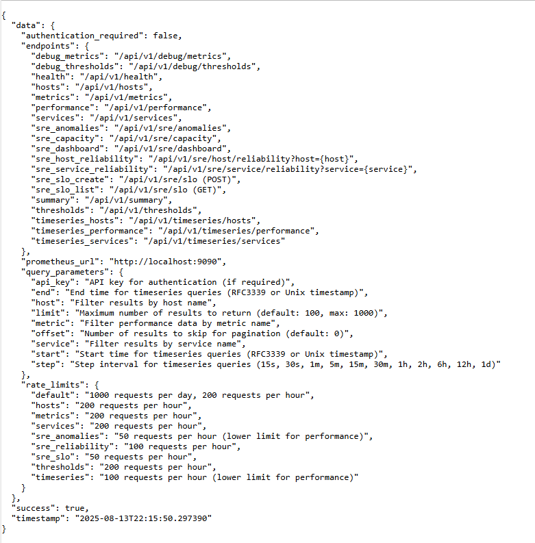
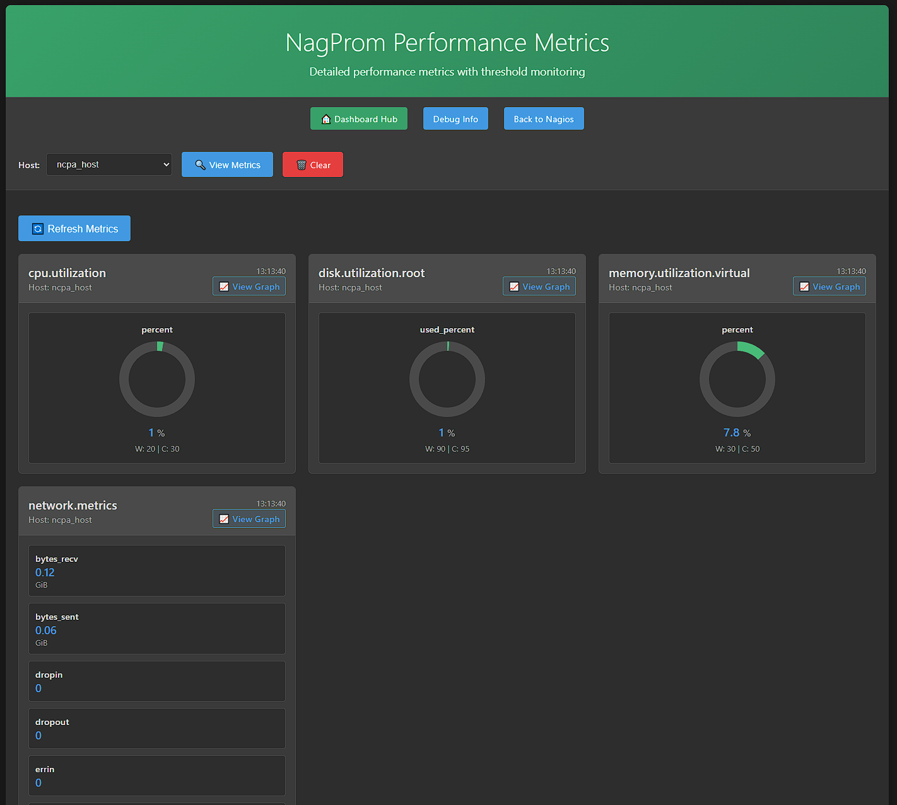
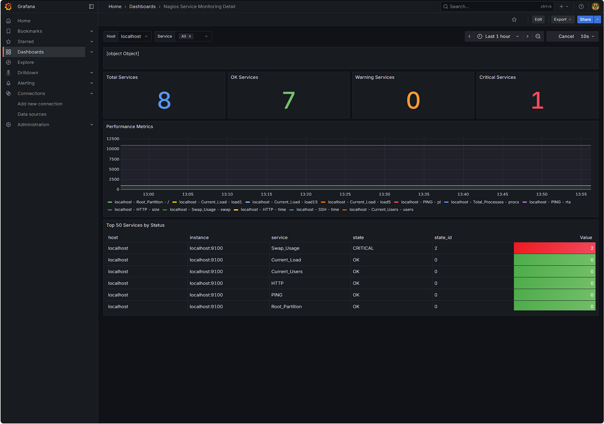
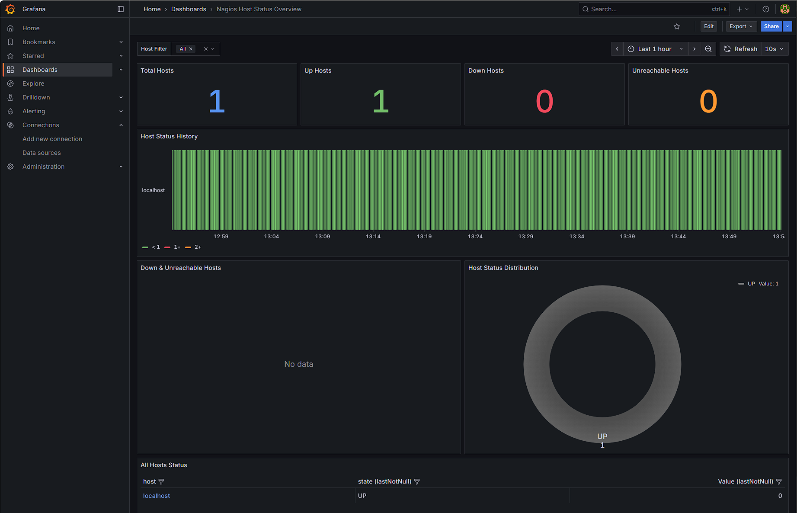

# NagProm - Advanced Nagios Monitoring with Prometheus Integration

[](https://python.org)
[](LICENSE)
[](CHANGELOG.md)

Advanced monitoring solution combining Nagios reliability with Prometheus metrics, SRE analytics, and machine learning-powered alert correlation.

## 🚀 Features

### 🔍 **Alert Correlation Engine**
- **ML-powered clustering** using DBSCAN and TF-IDF similarity
- **Multi-dimensional correlation**: Temporal, spatial, similarity, dependency-based
- **Pattern recognition** and noise reduction
- **Root cause analysis** with automated suggestions
- **Predictive alerting** based on historical patterns

### 📊 **SRE Analytics Engine**
- **Service Level Objectives (SLO)** management and tracking
- **Error budget monitoring** with burn rate analysis
- **Reliability metrics**: MTTR, MTBF, availability percentages
- **Capacity planning** insights and trend analysis
- **Anomaly detection** using statistical analysis
- **Business impact analysis** with revenue impact calculations

### 🌐 **REST API**
- **Full-featured API** for monitoring data access
- **Prometheus integration** with query and query_range support
- **Rate limiting** and authentication
- **Time-series data** support for historical analysis
- **Embedded analytics** within the main API service

### 📈 **Grafana Dashboards**
- **Host Status Overview** - Comprehensive host monitoring
- **Service Status Overview** - Service-level monitoring
- **Service Monitoring Detail** - Detailed performance metrics
- **Pre-built panels** with threshold visualization

### 🔗 **Prometheus Integration**
- **Seamless metrics collection** from Nagios
- **Performance data parsing** and threshold extraction
- **Custom metrics** support
- **Real-time data** streaming capabilities

## 🏗️ Architecture

```
┌─────────────────────────────────────────────────────────┐
│                NagProm REST API                         │
│                   (Port 8080)                          │
├─────────────────────────────────────────────────────────┤
│  Core API     │  SRE Analytics  │  Alert Correlation   │
│  - /api/v1/hosts  │  - /api/v1/sre  │  - Background      │
│  - /api/v1/services│  - Embedded     │  - Processing      │
│  - /api/v1/dashboard│  - Processing   │  - Webhooks        │
└─────────────────────────────────────────────────────────┘
                              │
                              ▼
┌─────────────────────────────────────────────────────────┐
│                Prometheus                                │
│              (Port 9090)                                │
└─────────────────────────────────────────────────────────┘
```

## 🚀 Quick Start

### Prerequisites
- Python 3.8+ (recommended: 3.11 or 3.12)
- Prometheus server running
- Nagios Core with performance data enabled

### Installation

#### Basic Installation (API Only)
```bash
# Clone the repository
git clone https://github.com/yourusername/nagprom.git
cd nagprom

# Install core dependencies
pip install -r api/requirements.txt

# Start the API server
python api/nagprom_rest_api.py --host 0.0.0.0 --port 8080
```

#### Full Installation (with Analytics)
```bash
# Install all dependencies including ML libraries
pip install -r api/requirements.txt

# For Windows users (if NumPy issues occur)
pip install numpy==1.21.6 --only-binary=numpy
pip install scikit-learn networkx
```

#### Production Installation (Recommended)
```bash
# Install API with all features
cd nagprom/api/
sudo ./install.sh --clean --skipssl --server-name your-server.com --allowed-networks "127.0.0.1 192.168.1.0/24"

# Install Nagios dashboard components
cd ../clients/nagios/
sudo ./install.sh

# Verify installation
curl http://localhost/nagprom/api/v1/health
curl http://localhost/nagprom/api/v1/sre/alerts/correlation
```

# Start the API server
python api/nagprom_rest_api.py --host 0.0.0.0 --port 8080
```

#### Linux Installation (Recommended)
```bash
# Standard Linux installation - all dependencies work correctly
pip install -r api/requirements.txt

# For production environments, consider using a virtual environment
python -m venv nagprom-env
source nagprom-env/bin/activate
pip install -r api/requirements.txt
```

#### Windows-Specific Installation (If Needed)
```bash
# Use Python 3.11 or 3.12 for best compatibility
# Install dependencies with specific versions
pip install numpy==1.21.6 pandas==1.5.3 scikit-learn==1.1.3 networkx==2.8.8
pip install -r api/requirements.txt
```

### Configuration

The API server can be configured via environment variables:

```bash
# API Configuration
export NAGPROM_HOST=0.0.0.0
export NAGPROM_PORT=8080
export NAGPROM_DEBUG=false

# Prometheus Configuration
export PROMETHEUS_URL=http://localhost:9090
export PROMETHEUS_TIMEOUT=30

# Analytics Configuration
export ENABLE_ANALYTICS=true
export ANALYTICS_BATCH_SIZE=100
export CORRELATION_THRESHOLD=0.7
```

### Usage Examples

#### Basic API Usage
```bash
# Get all hosts
curl http://localhost:8080/api/v1/hosts

# Get specific host
curl http://localhost:8080/api/v1/hosts/webserver01

# Get host services
curl http://localhost:8080/api/v1/hosts/webserver01/services

# Get service metrics
curl http://localhost:8080/api/v1/services/webserver01/disk_usage
```

#### Analytics API Usage
```bash
# Get SRE metrics
curl http://localhost:8080/api/v1/sre/metrics

# Get alert correlations
curl http://localhost:8080/api/v1/analytics/correlations

# Get reliability trends
curl http://localhost:8080/api/v1/sre/reliability/webserver01
```

#### Prometheus Integration
```bash
# Query Prometheus metrics
curl "http://localhost:8080/api/v1/prometheus/query?query=up"

# Get time series data
curl "http://localhost:8080/api/v1/prometheus/query_range?query=rate(http_requests_total[5m])&start=2024-01-01T00:00:00Z&end=2024-01-01T23:59:59Z&step=1m"
```

### Dashboard Access

After starting the API server, access the web dashboards:

- **Main Dashboard**: http://localhost:8080/clients/nagios/
- **Metrics Dashboard**: http://localhost:8080/clients/nagios/metrics.php
- **Debug Dashboard**: http://localhost:8080/clients/nagios/debug.php
- **Graph Dashboard**: http://localhost:8080/clients/nagios/graph.php

#### Environment Variables
```bash
# Prometheus connection
export PROMETHEUS_URL=http://localhost:9090

# API authentication (optional)
export NAGPROM_API_KEY=your-secure-api-key

# Analytics configuration
export CORRELATION_WINDOW=900  # 15 minutes
export MIN_CLUSTER_SIZE=2
export CONFIDENCE_THRESHOLD=0.7
```

#### Nagios Integration
```bash
# Install Nagios client
cd clients/nagios/
sudo ./install.sh

# Access the dashboard
http://localhost/nagios/index.php
```

## 📖 Documentation

- **[API Guide](docs/api/REST_API_GUIDE.md)** - Complete REST API documentation
- **[SRE Analytics Guide](docs/user-guides/SRE_ANALYTICS_GUIDE.md)** - SRE features and usage
- **[Deployment Guide](docs/deployment/PRODUCTION_DEPLOYMENT_GUIDE.md)** - Production setup
- **[Analytics README](analytics/README.md)** - Advanced analytics documentation

## 🔧 Usage Examples

### API Usage
```bash
# Get all hosts
curl http://localhost:8080/api/v1/hosts

# Get service metrics
curl http://localhost:8080/api/v1/services

# Get SRE dashboard data
curl http://localhost:8080/api/v1/sre/dashboard

# Get alert correlation
curl http://localhost:8080/api/v1/sre/alerts/correlation
```

### Python Integration
```python
import requests

# Get monitoring data
response = requests.get('http://localhost:8080/api/v1/hosts')
hosts = response.json()['data']

# Get SRE metrics
sre_data = requests.get('http://localhost:8080/api/v1/sre/service/web-service/reliability')
reliability = sre_data.json()['data']
```

### Alert Correlation
```python
from analytics.alert_correlation import AlertCorrelationEngine, Alert, AlertSeverity

# Initialize engine
engine = AlertCorrelationEngine()

# Add alerts for correlation
alert = Alert(
    id="alert-001",
    timestamp=datetime.now(),
    service="web-service",
    host="web01",
    severity=AlertSeverity.CRITICAL,
    status="firing",
    title="High Response Time",
    description="Response time exceeds threshold"
)
engine.add_alert(alert)

# Perform correlation analysis
clusters = await engine.correlate_alerts()
```

## 📊 Screenshots

### API Interface


### Metrics Dashboard


### Service Monitoring


### Host Status Overview


## 🧪 Testing

### Unit Tests
```bash
# Run core tests
python -m pytest core/test_*.py

# Run API tests
python -m pytest api/test_*.py

# Run analytics tests
python -m pytest analytics/test_*.py
```

### Integration Tests
```bash
# Test API endpoints
python -m pytest tests/test_integration.py

# Test Prometheus connectivity
python -m pytest tests/test_prometheus.py
```

## 🔒 Security

- **API Key Authentication** (optional)
- **Rate Limiting** on all endpoints
- **CORS Configuration** for web access
- **Input Validation** and sanitization
- **Error Handling** without information leakage

## 🤝 Contributing

1. Fork the repository
2. Create a feature branch (`git checkout -b feature/amazing-feature`)
3. Commit your changes (`git commit -m 'Add amazing feature'`)
4. Push to the branch (`git push origin feature/amazing-feature`)
5. Open a Pull Request

### Development Setup
```bash
# Install development dependencies
pip install -r api/requirements.txt
pip install pytest pytest-cov black flake8

# Run code formatting
black .

# Run linting
flake8 .

# Run tests with coverage
pytest --cov=.
```

## 📝 License

This project is licensed under the MIT License - see the [LICENSE](LICENSE) file for details.

## 🙏 Acknowledgments

- **Nagios Core** - For the robust monitoring foundation
- **Prometheus** - For the powerful metrics collection
- **Scikit-learn** - For machine learning capabilities
- **Flask** - For the web framework
- **Grafana** - For visualization capabilities

## 📞 Support

- **Issues**: [GitHub Issues](https://github.com/yourusername/nagprom/issues)
- **Documentation**: [Wiki](https://github.com/yourusername/nagprom/wiki)
- **Discussions**: [GitHub Discussions](https://github.com/yourusername/nagprom/discussions)

## 🗺️ Roadmap

- [ ] **v1.2.0**: Enhanced ML models and prediction accuracy
- [ ] **v1.3.0**: Kubernetes integration and operator
- [ ] **v1.4.0**: Advanced visualization and custom dashboards
- [ ] **v2.0.0**: Multi-tenant support and enterprise features

---

**Made with ❤️ for the DevOps and SRE community**

[](https://github.com/yourusername/nagprom)
[](https://github.com/yourusername/nagprom)
[](https://github.com/yourusername/nagprom/issues)
